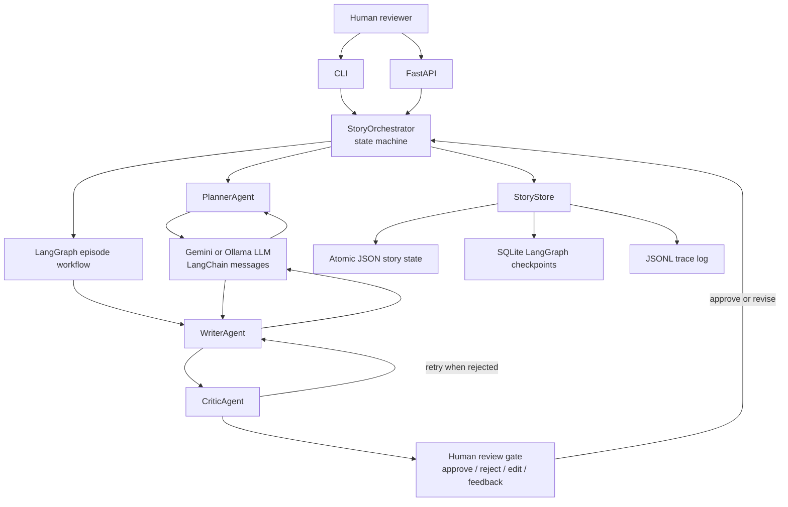

# Serial Story Writer

A small, resumable agentic story system for planning and writing a 200-episode serial with human review. It provides the required CLI plus a small FastAPI service. LangGraph runs the bounded writer-critic loop, while the planner, writer, critic, and persistence layers remain explicit and easy to inspect.

## Quick start

Requires Python 3.11 or newer. From the repository root:

```sh
uv sync

test -f .env || cp .env.example .env
# Add GOOGLE_API_KEY to .env before continuing.

uv run story-writer new "A talented young batter from a neighborhood club earns a place at a state cricket academy and must rebuild her game after a serious injury." --id recording
uv run story-writer plan recording
uv run story-writer approve-plan recording
uv run story-writer write recording
uv run story-writer review recording 1 approve
uv run story-writer write recording
```

`uv sync` creates the project environment from `pyproject.toml` and installs the
editable package and declared framework dependencies. The checked-in `uv.lock`
keeps the toolchain resolution repeatable. Copy `.env.example` to `.env` and add
your `GOOGLE_API_KEY` before running the application. A standard virtual environment also
works if `uv` is unavailable; `requirements.txt` installs the same local
package and its declared dependencies:

```sh
python -m venv .venv
. .venv/bin/activate
python -m pip install -r requirements.txt
```

The default data directory is `.story-data`. Use `--data-dir path` before the command to keep multiple runs separate. Every command reloads JSON state, so stopping after any episode and running the next command later resumes the story.

### Command anatomy

Every command starts with:

```text
uv run story-writer <command> <arguments>
```

- `uv run` runs a command inside the project environment created by `uv sync`.
- `story-writer` is this project's installed CLI entry point. It maps to `story_writer.cli`.
- `new`, `plan`, `approve-plan`, `write`, `review`, `feedback`, `show`, `edit-plan`, and `edit-history` are subcommands implemented by the CLI.
- `recording` is a story ID. It is just a label chosen when the story is created; `demo`, `story-1`, or `my-cricket-story` would work too.
- `--id recording` assigns that label during `new`. It is not an instruction to create episode 1 or a special keyword.
- `plan recording` means: call the `plan` subcommand and load the saved story whose ID is `recording`.
- `write recording` means: generate the next episode for that saved story.
- `review recording 1 approve` means: review episode `1` in story `recording` and approve it.

For example, these two commands refer to the same story if the first command
created it with `--id recording`:

```sh
uv run story-writer plan recording
uv run story-writer write recording
```

The story ID is used to locate files such as `.story-data/recording.json` and
`.story-data/recording.trace.jsonl`.

## Usage Walkthrough

The names `demo`, `recording`, and `story-1` are not special values. They are
story IDs chosen by the person running the program. Use one ID consistently for
the whole walkthrough. The commands below use `recording`.

### 1. Prepare the environment

From the repository root:

```sh
uv sync
test -f .env || cp .env.example .env
```

For Gemini, open `.env` and replace `replace-with-your-api-key` with
`GOOGLE_API_KEY`. No API key is printed or stored in the repository. For a local
run, start Ollama and use the installed model instead:

```sh
ollama serve
uv run story-writer --provider ollama --model llama3.2:latest new "Your premise" --id recording
```

### 2. Create and inspect the 200-episode plan

```sh
uv run story-writer new "A talented young batter from a neighborhood club earns a place at a state cricket academy and must rebuild her game after a serious injury." --id recording
uv run story-writer plan recording
```

`new` creates `recording` as the story ID, sends the premise to the planner
agent, validates the returned arc, and saves the story in `.story-data`. The
`--id recording` option is simply a readable name for this story. `plan` prints
the generated 200-episode plan so a human can inspect it before any episode is
written.

### 3. Approve the plan and generate an episode

```sh
uv run story-writer approve-plan recording
uv run story-writer write recording
```

`approve-plan` is the first human-in-the-loop gate. `write` runs the writer and
critic agents through LangGraph, retries a rejected draft within the attempt
limit, and saves episode 1 as a draft awaiting review.

### 4. Exercise human feedback and rejection

```sh
uv run story-writer review recording 1 approve
uv run story-writer feedback recording "Slow down the friendship; trust must be earned through action."
uv run story-writer write recording
uv run story-writer review recording 2 reject "Let the recovery breathe before the comeback."
uv run story-writer write recording
```

The first `review` approves episode 1 and allows canon to advance. `feedback`
stores a durable creative directive that is included in later model context.
The second `review` rejects episode 2, removes it from the approved story, and
resets the cursor so the next `write` regenerates episode 2 rather than moving
to episode 3.

### 5. Inspect resumability and observability

```sh
uv run story-writer show recording
uv run story-writer plan recording > recording-plan.json
```

`show` displays the current status, next episode, and episode count. JSON state
is stored in `.story-data/recording.json`; LangGraph checkpoints are stored in
`.story-data/checkpoints.sqlite3`; and agent, review, latency, token, and cost
events are appended to `.story-data/recording.trace.jsonl`. Stop the terminal,
run the same commands later, and the story resumes from the persisted cursor.

For a five-minute recording, use the equivalent flow in `DEMO_SCRIPT.md` and
show the arc, one generated episode, a feedback directive, a rejection, the
regenerated episode number, and the trace file.

## What This Project Delivers

This repository implements an agentic serial-story workflow rather than a single prompt that generates a long document:

- A planner agent creates and validates an ordered 200-episode arc.
- A writer agent generates one episode at a time from the current plan and bounded story memory.
- A critic agent checks the draft before it reaches the human review gate.
- A human can approve, reject, edit, add feedback, or rewrite history.
- Rejected drafts do not advance the story cursor.
- Approved episodes update canon; retroactive edits discard dependent episodes and rebuild canon.
- JSON state makes the workflow resumable after interruption.
- JSON Lines tracing records agent phases, review decisions, word counts, latency, token estimates, and estimated cost.
- The application supports Google Gemini and local Ollama; the deterministic local provider is retained only for tests and offline fixture generation.

The workflow uses LangGraph for the bounded draft-critic-retry graph, FastAPI for HTTP access, and LangChain/Google Gemini for the model-driven planner and writer. CrewAI is not used because the explicit three-role graph is smaller and easier to review for this assignment.

## Project Layout

```text
story_writer/
	agents.py       Planner, writer, and critic agent roles
	cli.py          Command-line interface and command dispatch
	engine.py       Story state machine and review transitions
	workflow.py     LangGraph writer-critic-retry graph
	api.py          FastAPI application and HTTP endpoints
	models.py       Dataclasses and JSON serialization helpers
	provider.py     Google Gemini provider and test-only deterministic fixture provider
	store.py        Atomic state persistence and JSONL tracing
tests/
	test_engine.py  Workflow, constraint, rejection, and history tests
scripts/
	make_demo.py    Rebuilds the checked-in cricket story demo
demo/
	arc.json        Approved 200-episode plan
	episodes/       Fifteen approved episode drafts
	state.json      Demo state snapshot
	state/          Demo state and trace files
README.md         Setup, operation, and verification guide
DECISIONS.md      Architecture and tradeoff record
DEMO_SCRIPT.md    Short recording walkthrough
pyproject.toml    Package metadata and CLI entry point
uv.lock           Reproducible uv dependency resolution
```

## Requirements Coverage

| Requirement | Implementation |
| --- | --- |
| Agentic behavior | Separate planner, writer, and critic agents coordinated by `StoryOrchestrator` and LangGraph |
| Long-form planning | Exactly 200 sequential `EpisodePlan` records are required before writing |
| Incremental generation | One episode is drafted per `write` command |
| Human-in-the-loop review | Arc approval, episode approval, rejection, edits, feedback, and history rewrites |
| Layered memory | Structured arc, compact canon, character states, timeline, open threads, and durable directives |
| Resumability | Atomic JSON state reloads on every CLI command |
| Quality control | 400-700 word gate, hook check, required-character consistency check, repetition check, retry limit, and review checkpoint |
| Observability | Append-only JSONL events with agent and cost metadata |
| Cost awareness | Bounded context and estimated token/cost fields in traces |
| Checked-in review fixture | Deterministic fixture output generated by the test-only provider |
| Real model execution | Google Gemini adapter using `GOOGLE_API_KEY` or local Ollama using `OLLAMA_MODEL` |
| API option | FastAPI service with a Uvicorn entry point; CLI remains the primary demo path |
| Reproducible setup | `pyproject.toml` plus checked-in `uv.lock` |

## Command Reference

Run commands with `uv run story-writer ...`. Put global options such as `--data-dir` and `--model` before the subcommand.

```sh
# Create a story and generate its 200-episode plan.
uv run story-writer new "Your premise" --id story-1

# Inspect, approve, or replace the arc.
uv run story-writer plan story-1
uv run story-writer approve-plan story-1
uv run story-writer edit-plan story-1 reviewed-plan.json

# Draft and review episodes.
uv run story-writer write story-1
uv run story-writer review story-1 1 approve
uv run story-writer review story-1 2 reject "Raise the pressure before the comeback."
uv run story-writer review story-1 2 edit reviewed-episode.txt

# Add future-facing feedback and inspect resumable state.
uv run story-writer feedback story-1 "Let the partnership develop through action."
uv run story-writer show story-1
uv run story-writer edit-history story-1 1 replacement-episode.txt
```

The `edit` review command reads the replacement text from the file path supplied as its final argument. The `edit-history` command validates the replacement, removes later episodes, rebuilds canon, and resumes at the following episode.

### Command details

All commands use the same saved story ID. The examples below use `story-1`, but
you can replace it with any ID you chose after `--id`.

| Command | What it does | Human or file input |
| --- | --- | --- |
| `new "premise" --id story-1` | Creates the story state, calls the planner, validates exactly 200 sequential episode plans, and saves the story in `.story-data/story-1.json`. | The premise and optional story ID. |
| `plan story-1` | Prints the saved 200-episode plan, including phases, characters, episode purposes, hooks, and story threads. | Human inspects the plan. |
| `approve-plan story-1` | Marks the reviewed plan as approved and changes the story from planning to writing. | Human approval. |
| `edit-plan story-1 reviewed-plan.json` | Replaces the generated plan with a reviewed JSON file, validates its shape, and returns it to the approval state. | A JSON file containing episodes 1 through 200. |
| `write story-1` | Generates the next episode with the writer agent, runs the critic and bounded retry graph, stores checkpoints, and saves the draft awaiting review. | The model uses the plan, canon, threads, and directives. |
| `review story-1 1 approve` | Marks episode 1 approved and rebuilds canon from approved episodes. | Human reads the draft and approves it. |
| `review story-1 1 reject "feedback"` | Removes the draft, keeps the cursor at episode 1, and stores the feedback as a future directive. | Human rejection and optional feedback. |
| `review story-1 1 edit reviewed-episode.txt` | Replaces episode 1 with text from a file, validates the replacement, and marks it approved. | A 400-700 word replacement text file. |
| `feedback story-1 "creative direction"` | Adds a durable instruction to future writer prompts without changing the current episode. | Human creative direction. |
| `show story-1` | Displays the current status, next episode number, and number of saved episodes. | No additional input. |
| `edit-history story-1 1 replacement-episode.txt` | Rewrites a previously approved episode, removes all later episodes, rebuilds canon, and resumes at the next episode. | A validated replacement text file. |

The commands are intentionally sequential. Do not approve the plan before
inspecting `plan story-1`, and do not approve an episode before reading the
draft. A rejected episode does not advance the cursor, so the next `write`
command generates the same episode number again.

For a real model run, add `GOOGLE_API_KEY` to `.env` (or export it) and run:

```sh
uv run story-writer --model gemini-flash-lite-latest new "Your premise" --id production
```

The provider uses LangChain's Google Gemini integration for model calls. Set
`GEMINI_MODEL` to select a different Gemini model.

To run the optional FastAPI service locally:

```sh
uv run story-writer-api
```

The service listens on `http://127.0.0.1:8000` by default. Set `HOST`, `PORT`,
or `STORY_DATA_DIR` to change the bind address or persistence directory. It
provides health, story creation and retrieval, arc approval, next-episode
generation, durable feedback, and episode review endpoints. The interactive CLI
remains the simplest five-minute demonstration path.

## Human review

- `plan <id>` prints the complete 200-episode plan.
- `edit-plan <id> reviewed-plan.json` replaces the plan and requires approval again. The file must contain exactly episodes 1 through 200.
- `review <id> <episode> approve` accepts an episode.
- `review <id> <episode> reject "feedback"` removes the draft, resets the cursor, and carries the feedback into the next draft and all future context.
- `review <id> <episode> edit replacement.txt` replaces an episode with reviewed text and validates its length.
- `feedback <id> "slow down the friendship"` adds a durable story directive without changing the current episode.
- `edit-history <id> <episode> replacement.txt` handles a retroactive rewrite. It discards later episodes, rebuilds canon through the edited point, and resumes at the next episode.
- `show <id>` displays the current status and resume cursor.

## Design

`StoryState` is the source of truth. It contains the approved arc, a compact canon, durable directives, reviewed episode records, and the next episode cursor. The canon keeps facts, character states, timeline entries, and open threads separate from prose. `build_context` retrieves only recent facts and threads plus the current episode plan; the complete 200-episode plan remains available as structured data without stuffing all prose into the prompt.

The agent loop is intentionally small:

```text
PlannerAgent -> approved arc
WriterAgent -> episode draft
CriticAgent -> length, hook, and repetition signals
Human -> approve, edit, reject, or add a durable directive
```

The writer may retry once when the critic rejects a draft. A failed critic gate never advances the story cursor. The LangGraph workflow has a hard attempt limit, so a failed episode cannot loop indefinitely.

`StoryStore` writes readable JSON atomically and appends JSON Lines trace events. Traces include agent decisions, episode word counts, latency, estimated tokens, and estimated cost. The generated provider output is checked by the same hard 400-700 word validation gate and state controls regardless of the configured model.

## Architecture



The planner creates the 200-episode structure before generation begins. For each
episode, LangGraph coordinates the writer and critic, retrying within a hard
attempt limit. The human review gate controls what becomes canon, while the
store keeps story state, graph checkpoints, and observability data durable.

## Demo and tests

The reproducible demo is generated with:

```sh
uv run python scripts/make_demo.py
```

It creates `demo/arc.json`, 15 episode files, a trace, and a state snapshot. The script demonstrates two interventions: a friendship directive after episode 3 and a rejection with feedback after episode 7. The checked-in `demo/` directory is a deterministic fixture generated separately for review; application execution uses the LLM provider.

Run the tests with:

```sh
uv run python -m unittest discover -s tests -v
```

Run the complete local verification from the repository root:

```sh
uv run python -m unittest discover -s tests -v
uv run python -m compileall -q story_writer scripts
uv run python scripts/make_demo.py
uv run python -c "from pathlib import Path; files=sorted(Path('demo/episodes').glob('*.txt')); assert len(files) == 15; counts=[len(p.read_text(encoding='utf-8').split()) for p in files]; assert all(400 <= count <= 700 for count in counts); print(f'{len(files)} demo episodes verified; {min(counts)}-{max(counts)} words')"
```

The final command verifies that the demo regenerated 15 episode files and that
every generated episode remains within the 400-700 word gate. The approved
status is stored in `demo/state.json`, while agent decisions and review events
are stored in `demo/state/demo.trace.jsonl`.

## Cost and scale

The trace estimates output usage using 1.3 tokens per output word. An estimated
`STORY_EPISODE_COST_CAP_USD` of `$0.02` per episode is enforced before a draft is
persisted; it covers the output estimate and bounded retries, not the provider's
actual invoice. For an LLM priced at $5 per million input tokens and $15 per
million output tokens, assuming 4,000 retrieved input tokens and 500 output
words per episode, 200 episodes plus planning are approximately $6-$8 before
retries. A hosted run should take roughly 2-4 hours at 30-60 seconds per
episode; local Ollama time depends on hardware and its batched 200-episode plan.
The system reduces cost by keeping old prose out of context, retrieving compact
canon, generating one episode at a time, and requiring a human decision before
advancing.

## Known limits

Gemini requires `GOOGLE_API_KEY`; Ollama requires a running local daemon and a
downloaded model. The deterministic provider exists only to generate the
checked-in fixture and keep automated tests credential-free. Long-running
quality still benefits from periodic arc reviews and stronger semantic fact and
repetition checks. The current critic reliably enforces length, hooks, planned
character presence, retry bounds, and near-duplicate rejection, but it cannot
prove semantic contradiction absence; that remains a deliberate, documented
production limitation.
